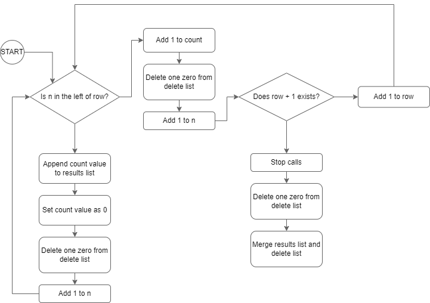

# Atod Clusters solution for technical evaluation

This documentation provides a comprehensive solution for the technical evaluation in the Robotics Advanced Course. The problem was successfully tackled using Python programming. The details of the solution are outlined below:

## Inputs
- N = number of stars in the sky
- M = number of magical connections drawn
- Ai = star number Invoker identified
- Bi = star number Puck pointed out

## Outputs
- K = total number of Atod Clusters formed
- Subsequent K rows = list the number of connections each Atod Cluster has

## Assumptions
1. The stars are numbered from 1 to N, this inicates that 1 is always the first number.
2. The arrays are always organized.

## Initial values
- ***n*** = 1
- ***count*** = 0
- ***row*** = 0
- ***delete_list*** = [0] * N
- ***results_list*** = [ ]

## Flow chart

